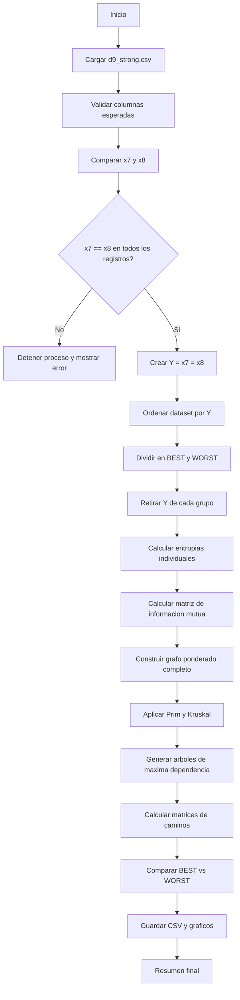
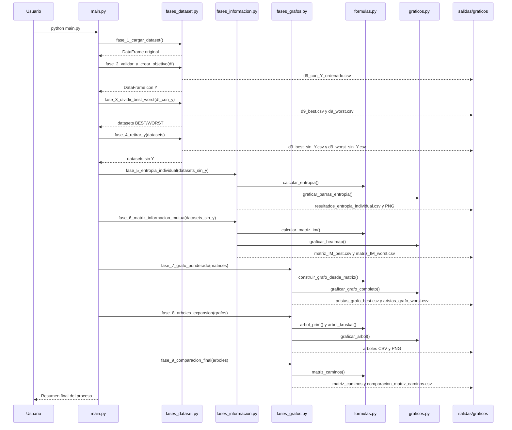

# Analisis de Entropia, Informacion Mutua y Arboles de Maxima Dependencia

Proyecto en Python para analizar un dataset discreto mediante entropia de Shannon, informacion mutua y grafos ponderados. El flujo procesa el archivo `d9_strong.csv`, valida las variables objetivo, separa los registros en los grupos `BEST` y `WORST`, calcula dependencias entre variables y construye arboles de maxima dependencia usando los algoritmos de Prim y Kruskal.

El objetivo principal no es entrenar un modelo predictivo, sino estudiar como se relacionan las variables del dataset y comparar si la estructura de dependencia cambia entre los grupos `BEST` y `WORST`.

## Contenido

- [Descripcion general](#descripcion-general)
- [Estructura del proyecto](#estructura-del-proyecto)
- [Requisitos](#requisitos)
- [Instalacion y ejecucion](#instalacion-y-ejecucion)
- [Dataset de entrada](#dataset-de-entrada)
- [Flujo completo del proceso](#flujo-completo-del-proceso)
- [Secuencia de ejecucion](#secuencia-de-ejecucion)
- [Fases del proyecto](#fases-del-proyecto)
- [Fundamento teorico](#fundamento-teorico)
- [Archivos generados](#archivos-generados)
- [Resultados principales](#resultados-principales)
- [Interpretacion final](#interpretacion-final)
- [Notas de uso](#notas-de-uso)

## Descripcion General

El proyecto toma como entrada un dataset con 1000 registros y 9 variables:

```text
x1, x2, x5, x4, x6, x9, x3, x7, x8
```

Las variables `x7` y `x8` se validan como equivalentes. Si ambas coinciden en todos los registros, se crea una nueva variable objetivo:

```text
Y = x7 = x8
```

La interpretacion usada es:

- `Y = 1`: grupo `BEST`
- `Y = 0`: grupo `WORST`

Despues de crear `Y`, el dataset se divide en dos subconjuntos. Luego se retira `Y` de cada grupo porque, dentro de `BEST`, siempre vale 1 y, dentro de `WORST`, siempre vale 0. Al ser constante, no aporta variabilidad para el analisis interno.

Con las variables restantes se calculan:

- Entropias individuales.
- Matrices de informacion mutua.
- Grafos ponderados completos.
- Arboles de maxima dependencia con Prim.
- Arboles de maxima dependencia con Kruskal.
- Matrices de caminos sobre los arboles.
- Comparacion final entre `BEST` y `WORST`.

## Estructura del Proyecto

```text
.
|-- main.py
|-- config.py
|-- formulas.py
|-- utilidades.py
|-- fases_dataset.py
|-- fases_informacion.py
|-- fases_grafos.py
|-- graficos.py
|-- d9_strong.csv
|-- requirements.txt
|-- informe_entropia.tex
|-- graficos/
|   |-- entropia_best.png
|   |-- entropia_worst.png
|   |-- comparacion_entropias_best_worst.png
|   |-- heatmap_IM_best.png
|   |-- heatmap_IM_worst.png
|   |-- grafo_ponderado_best.png
|   |-- grafo_ponderado_worst.png
|   |-- arbol_prim_best.png
|   |-- arbol_prim_worst.png
|   |-- arbol_kruskal_best.png
|   |-- arbol_kruskal_worst.png
|   `-- comparacion_arboles_best_worst.png
`-- salidas/
    |-- datasets/
    |   |-- d9_con_Y_ordenado.csv
    |   |-- d9_best.csv
    |   |-- d9_worst.csv
    |   |-- d9_best_sin_Y.csv
    |   `-- d9_worst_sin_Y.csv
    `-- tablas/
        |-- resultados_entropia_individual.csv
        |-- matriz_IM_best.csv
        |-- matriz_IM_worst.csv
        |-- aristas_grafo_best.csv
        |-- aristas_grafo_worst.csv
        |-- arbol_prim_best.csv
        |-- arbol_prim_worst.csv
        |-- arbol_kruskal_best.csv
        |-- arbol_kruskal_worst.csv
        |-- matriz_caminos_best.csv
        |-- matriz_caminos_worst.csv
        `-- comparacion_matriz_caminos.csv
```

### Modulos Principales

| Archivo | Funcion |
|---|---|
| `main.py` | Coordina la ejecucion completa por fases. |
| `config.py` | Define rutas, archivo de entrada, columnas esperadas y carpetas de salida. |
| `fases_dataset.py` | Carga el dataset, valida `x7` y `x8`, crea `Y`, divide en `BEST`/`WORST` y retira `Y`. |
| `fases_informacion.py` | Calcula entropias individuales y matrices de informacion mutua. |
| `fases_grafos.py` | Construye grafos ponderados, arboles de expansion y comparaciones finales. |
| `formulas.py` | Contiene las formulas y algoritmos: entropia, informacion mutua, Prim, Kruskal y matriz de caminos. |
| `graficos.py` | Genera imagenes PNG para heatmaps, barras, grafos y arboles. |
| `utilidades.py` | Funciones auxiliares para imprimir encabezados, guardar CSV, crear carpetas y dibujar texto. |
| `informe_entropia.tex` | Informe academico en LaTeX con metodologia, resultados y conclusiones. |

## Requisitos

El proyecto usa Python y las siguientes librerias:

```text
pandas
numpy
pillow
```

Estan declaradas en `requirements.txt`.

## Instalacion y Ejecucion

1. Crear un entorno virtual:

```bash
python -m venv .venv
```

2. Activar el entorno virtual.

En Windows PowerShell:

```powershell
.\.venv\Scripts\Activate.ps1
```

En Linux/macOS:

```bash
source .venv/bin/activate
```

3. Instalar dependencias:

```bash
pip install -r requirements.txt
```

4. Ejecutar el proyecto:

```bash
python main.py
```

El programa se ejecuta por fases y hace pausas con `Enter` para que se pueda revisar la salida de consola paso a paso.

## Dataset de Entrada

El archivo principal es:

```text
d9_strong.csv
```

Columnas esperadas:

```python
["x1", "x2", "x5", "x4", "x6", "x9", "x3", "x7", "x8"]
```

Columnas usadas para el analisis interno despues de retirar `Y`:

```python
["x1", "x2", "x5", "x4", "x6", "x9", "x3"]
```

Caracteristicas del dataset procesado:

| Caracteristica | Valor |
|---|---:|
| Registros totales | 1000 |
| Variables originales | 9 |
| Variables internas analizadas | 7 |
| Registros `BEST` | 502 |
| Registros `WORST` | 498 |
| Archivo de entrada | `d9_strong.csv` |

## Flujo Completo del Proceso



## Secuencia de Ejecucion



## Fases del Proyecto

### Fase 1: Carga y revision del dataset

Funcion principal:

```python
fase_1_cargar_dataset()
```

Acciones:

- Lee `d9_strong.csv`.
- Muestra cantidad de registros.
- Muestra variables encontradas.
- Compara el orden de columnas con `COLUMNAS_ESPERADAS`.
- Imprime las primeras filas.
- Muestra conteo de valores por variable.

### Fase 2: Validacion de `x7` y `x8`, creacion de `Y`

Funcion principal:

```python
fase_2_validar_y_crear_objetivo(df)
```

Acciones:

- Verifica si `x7` y `x8` coinciden registro por registro.
- Si hay diferencias, detiene el proceso con un error.
- Si coinciden, crea `Y = x7 = x8`.
- Ordena el dataset por `Y`.
- Guarda `salidas/datasets/d9_con_Y_ordenado.csv`.

Resultado del proyecto:

```text
x7 == x8 en los 1000 registros
```

### Fase 3: Division en `BEST` y `WORST`

Funcion principal:

```python
fase_3_dividir_best_worst(df_con_y)
```

Criterio:

- `BEST`: registros con `Y = 1`.
- `WORST`: registros con `Y = 0`.

Archivos generados:

- `salidas/datasets/d9_best.csv`
- `salidas/datasets/d9_worst.csv`

### Fase 4: Retiro de `Y`

Funcion principal:

```python
fase_4_retirar_y(datasets)
```

Motivo:

Dentro de cada grupo, `Y` es constante. Por tanto:

```text
H(Y) = 0
```

Como no aporta incertidumbre ni variabilidad interna, se retira para calcular dependencias solo entre las variables `x1`, `x2`, `x5`, `x4`, `x6`, `x9` y `x3`.

Archivos generados:

- `salidas/datasets/d9_best_sin_Y.csv`
- `salidas/datasets/d9_worst_sin_Y.csv`

### Fase 5: Entropia individual

Funcion principal:

```python
fase_5_entropia_individual(datasets_sin_y)
```

Calcula la entropia de Shannon para cada variable en cada grupo.

Archivo generado:

- `salidas/tablas/resultados_entropia_individual.csv`

Graficos generados:

- `graficos/entropia_best.png`
- `graficos/entropia_worst.png`
- `graficos/comparacion_entropias_best_worst.png`

### Fase 6: Matriz de informacion mutua

Funcion principal:

```python
fase_6_matriz_informacion_mutua(datasets_sin_y)
```

Calcula la informacion mutua para cada par de variables. La matriz resultante es simetrica y su diagonal cumple:

```text
I(X;X) = H(X)
```

Archivos generados:

- `salidas/tablas/matriz_IM_best.csv`
- `salidas/tablas/matriz_IM_worst.csv`

Graficos generados:

- `graficos/heatmap_IM_best.png`
- `graficos/heatmap_IM_worst.png`

### Fase 7: Grafo ponderado

Funcion principal:

```python
fase_7_grafo_ponderado(matrices)
```

Construye un grafo completo por cada grupo:

- Cada variable es un nodo.
- Cada arista representa una relacion entre dos variables.
- El peso de la arista es la informacion mutua entre esas variables.

Archivos generados:

- `salidas/tablas/aristas_grafo_best.csv`
- `salidas/tablas/aristas_grafo_worst.csv`

Graficos generados:

- `graficos/grafo_ponderado_best.png`
- `graficos/grafo_ponderado_worst.png`

### Fase 8: Arbol de maxima dependencia

Funcion principal:

```python
fase_8_arboles_expansion(grafos)
```

Se construye un arbol de expansion de maxima dependencia. A diferencia de un arbol de costo minimo, aqui se eligen las aristas con mayor informacion mutua, porque representan relaciones mas fuertes.

Algoritmos usados:

- Prim.
- Kruskal.

Criterio:

```text
Conectar todas las variables sin ciclos usando n - 1 aristas
```

Archivos generados:

- `salidas/tablas/arbol_prim_best.csv`
- `salidas/tablas/arbol_prim_worst.csv`
- `salidas/tablas/arbol_kruskal_best.csv`
- `salidas/tablas/arbol_kruskal_worst.csv`

Graficos generados:

- `graficos/arbol_prim_best.png`
- `graficos/arbol_prim_worst.png`
- `graficos/arbol_kruskal_best.png`
- `graficos/arbol_kruskal_worst.png`
- `graficos/comparacion_arboles_best_worst.png`

### Fase 9: Comparacion final

Funcion principal:

```python
fase_9_comparacion_final(arboles)
```

La comparacion se realiza sobre los arboles de Kruskal. Para cada par de variables se calcula el unico camino dentro del arbol y se suman los pesos de las aristas que lo componen.

Archivos generados:

- `salidas/tablas/matriz_caminos_best.csv`
- `salidas/tablas/matriz_caminos_worst.csv`
- `salidas/tablas/comparacion_matriz_caminos.csv`

## Fundamento Teorico

### Entropia de Shannon

La entropia mide la incertidumbre o variabilidad de una variable discreta.

```text
H(X) = - sum P(x) * log2(P(x))
```

Interpretacion:

- Entropia baja: la variable es mas predecible.
- Entropia alta: la variable tiene mas variabilidad.

### Informacion Mutua

La informacion mutua mide cuanta informacion comparte una variable con otra.

```text
I(X;Y) = sum_x sum_y P(x,y) * log2(P(x,y) / (P(x) * P(y)))
```

Interpretacion:

- `I(X;Y) = 0`: independencia estadistica aproximada.
- `I(X;Y) > 0`: existe dependencia o relacion informativa.
- Mientras mayor sea el valor, mas fuerte es la relacion.

### Grafo Ponderado

Cada variable se representa como un nodo:

```text
Nodo = variable
```

Cada arista se pondera con informacion mutua:

```text
peso(xi, xj) = I(xi; xj)
```

La diagonal de la matriz no se usa como arista porque representa `I(X;X)`, que equivale a la entropia de la misma variable.

### Arbol de Maxima Dependencia

Un arbol de expansion conecta todos los nodos sin formar ciclos. En este proyecto se busca maximizar la suma de pesos:

```text
W(T) = sum I(u;v), para cada arista (u,v) del arbol
```

Como los pesos son informacion mutua, se prefieren pesos grandes. Por eso se habla de arbol de maxima dependencia.

## Archivos Generados

### Datasets

| Archivo | Descripcion |
|---|---|
| `salidas/datasets/d9_con_Y_ordenado.csv` | Dataset original transformado, con `Y` creada y ordenado por clase. |
| `salidas/datasets/d9_best.csv` | Registros con `Y = 1`. |
| `salidas/datasets/d9_worst.csv` | Registros con `Y = 0`. |
| `salidas/datasets/d9_best_sin_Y.csv` | Dataset `BEST` sin la columna `Y`. |
| `salidas/datasets/d9_worst_sin_Y.csv` | Dataset `WORST` sin la columna `Y`. |

### Tablas

| Archivo | Descripcion |
|---|---|
| `resultados_entropia_individual.csv` | Entropia de cada variable por grupo. |
| `matriz_IM_best.csv` | Matriz de informacion mutua para `BEST`. |
| `matriz_IM_worst.csv` | Matriz de informacion mutua para `WORST`. |
| `aristas_grafo_best.csv` | Aristas del grafo completo `BEST`, ordenadas por peso. |
| `aristas_grafo_worst.csv` | Aristas del grafo completo `WORST`, ordenadas por peso. |
| `arbol_prim_best.csv` | Aristas seleccionadas por Prim para `BEST`. |
| `arbol_prim_worst.csv` | Aristas seleccionadas por Prim para `WORST`. |
| `arbol_kruskal_best.csv` | Aristas seleccionadas por Kruskal para `BEST`. |
| `arbol_kruskal_worst.csv` | Aristas seleccionadas por Kruskal para `WORST`. |
| `matriz_caminos_best.csv` | Suma de caminos entre variables en el arbol `BEST`. |
| `matriz_caminos_worst.csv` | Suma de caminos entre variables en el arbol `WORST`. |
| `comparacion_matriz_caminos.csv` | Comparacion final entre `BEST` y `WORST`. |

### Graficos

| Archivo | Descripcion |
|---|---|
| `entropia_best.png` | Barras de entropia individual para `BEST`. |
| `entropia_worst.png` | Barras de entropia individual para `WORST`. |
| `comparacion_entropias_best_worst.png` | Comparacion de entropias entre grupos. |
| `heatmap_IM_best.png` | Mapa de calor de informacion mutua para `BEST`. |
| `heatmap_IM_worst.png` | Mapa de calor de informacion mutua para `WORST`. |
| `grafo_ponderado_best.png` | Grafo completo ponderado para `BEST`. |
| `grafo_ponderado_worst.png` | Grafo completo ponderado para `WORST`. |
| `arbol_prim_best.png` | Arbol de maxima dependencia con Prim para `BEST`. |
| `arbol_prim_worst.png` | Arbol de maxima dependencia con Prim para `WORST`. |
| `arbol_kruskal_best.png` | Arbol de maxima dependencia con Kruskal para `BEST`. |
| `arbol_kruskal_worst.png` | Arbol de maxima dependencia con Kruskal para `WORST`. |
| `comparacion_arboles_best_worst.png` | Comparacion visual de arboles `BEST` y `WORST`. |

## Resultados Principales

### Distribucion de clases

| Grupo | Condicion | Registros |
|---|---|---:|
| `BEST` | `Y = 1` | 502 |
| `WORST` | `Y = 0` | 498 |
| Total | - | 1000 |

### Entropias individuales

| Variable | BEST | WORST |
|---|---:|---:|
| `x1` | 0.758564 | 0.735374 |
| `x2` | 0.999072 | 0.998592 |
| `x5` | 1.411587 | 1.416200 |
| `x4` | 0.747456 | 0.686015 |
| `x6` | 0.997422 | 0.999814 |
| `x9` | 1.744762 | 1.685441 |
| `x3` | 0.674114 | 0.743092 |

La variable con mayor entropia en ambos grupos es `x9`, lo que indica que es la variable con mayor variabilidad.

### Arbol de maxima dependencia para BEST

Aristas obtenidas por Kruskal:

| Origen | Destino | Peso |
|---|---|---:|
| `x6` | `x9` | 0.997422 |
| `x4` | `x9` | 0.747456 |
| `x2` | `x5` | 0.655467 |
| `x1` | `x5` | 0.414958 |
| `x5` | `x9` | 0.016187 |
| `x1` | `x3` | 0.002232 |

Peso total:

```text
2.833722
```

### Arbol de maxima dependencia para WORST

Aristas obtenidas por Kruskal:

| Origen | Destino | Peso |
|---|---|---:|
| `x6` | `x9` | 0.999814 |
| `x2` | `x5` | 0.686923 |
| `x4` | `x9` | 0.686015 |
| `x1` | `x5` | 0.423706 |
| `x5` | `x9` | 0.006917 |
| `x9` | `x3` | 0.005813 |

Peso total:

```text
2.809188
```

### Comparacion de caminos

| Variable | Suma BEST | Suma WORST | Diferencia | Diferencia absoluta |
|---|---:|---:|---:|---:|
| `x3` | 4.537088 | 2.852084 | 1.685004 | 1.685004 |
| `x4` | 7.034521 | 6.253096 | 0.781426 | 0.781426 |
| `x9` | 3.297242 | 2.823021 | 0.474221 | 0.474221 |
| `x6` | 8.284353 | 7.822090 | 0.462263 | 0.462263 |
| `x5` | 3.281054 | 2.829937 | 0.451117 | 0.451117 |
| `x1` | 4.525929 | 4.948468 | -0.422538 | 0.422538 |
| `x2` | 6.558388 | 6.264555 | 0.293833 | 0.293833 |

La mayor diferencia aparece en `x3`. En `BEST`, `x3` se conecta al arbol mediante `x1-x3`; en `WORST`, se conecta mediante `x9-x3`.

## Interpretacion Final

Los dos grupos mantienen una estructura central parecida. En ambos casos, la relacion mas fuerte es:

```text
x6 -- x9
```

Tambien aparecen como relaciones importantes:

- `x4 -- x9`
- `x2 -- x5`
- `x1 -- x5`
- `x5 -- x9`

La diferencia mas relevante esta en la variable `x3`, porque cambia su forma de conectarse al arbol segun el grupo:

- En `BEST`, `x3` se conecta por `x1`.
- En `WORST`, `x3` se conecta por `x9`.

Esto sugiere que la estructura principal de dependencia se conserva entre clases, pero algunas variables perifericas cambian de relacion segun el grupo analizado.

## Notas de Uso

- El programa hace pausas entre fases con `input()`. Para una ejecucion automatica, se puede modificar o desactivar la funcion `pausar()` en `utilidades.py`.
- Si se cambia el dataset de entrada, se debe revisar `COLUMNAS_ESPERADAS` y `COLUMNAS_ANALISIS` en `config.py`.
- El proceso requiere que `x7` y `x8` coincidan en todos los registros. Si no coinciden, la fase 2 detiene la ejecucion.
- Las carpetas `salidas/datasets`, `salidas/tablas` y `graficos` se crean automaticamente si no existen.
- Los archivos generados se sobrescriben en cada ejecucion.

## Referencias Conceptuales

- Shannon, C. E. (1948). A Mathematical Theory of Communication.
- Kruskal, J. B. (1956). On the Shortest Spanning Subtree of a Graph and the Traveling Salesman Problem.
- Prim, R. C. (1957). Shortest Connection Networks and Some Generalizations.
- Cover, T. M., & Thomas, J. A. (2006). Elements of Information Theory.
